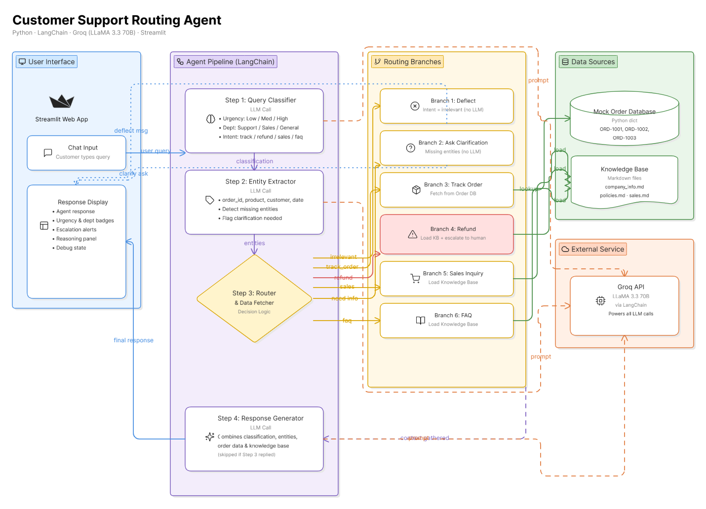

# 🛎️ Customer Support Routing Agent

An intelligent customer support agent that classifies incoming queries, extracts entities, routes to the appropriate department, and generates context-aware responses — all powered by **LLaMA 3.3 70B** on **Groq** via **LangChain**.

## 🏗️ Architecture



The system is composed of four distinct layers:

- **User Interface** — Streamlit chat app with conversation history
- **Agent Pipeline** — 4-step sequential processing via LangChain
- **Routing Branches** — 6-way agentic decision router
- **Data Sources** — Mock order database, markdown knowledge base, and Groq API

---

## 🔄 Pipeline Overview

The agent processes every customer query through a **4-step sequential pipeline**. Each step receives the shared `SupportAgentState` (a `TypedDict`), enriches it, and passes it to the next.

```
User Query → Step 1: Classify → Step 2: Extract Entities → Step 3: Route & Fetch → Step 4: Generate Response
```

| Step | Function | What It Does | LLM Call? |
|------|----------|-------------|-----------|
| **Step 1** | `classify_query()` | Classifies by urgency (Low/Med/High), department (Support/Sales/General), and intent | ✅ Yes |
| **Step 2** | `extract_entities()` | Extracts order IDs, product names, dates, customer names; flags missing required entities | ✅ Yes |
| **Step 3** | `route_and_fetch()` | Routes to one of 6 branches; fetches order data or loads knowledge base | ❌ No |
| **Step 4** | `generate_response()` | Builds final customer-facing response using all gathered context | ✅ Yes (conditional) |

Steps 1 and 2 use LLM calls for classification and extraction. Step 3 is pure Python decision logic. Step 4 calls the LLM only if Step 3 didn't already produce a response (early return cases).

---

## 🔀 The 6-Branch Routing Logic (Step 3)

Step 3 is the **agentic decision-making core** of the system. Based on the classification and extracted entities, it routes the query through one of six branches:

| Branch | Trigger Condition | Action | Early Return? |
|--------|------------------|--------|---------------|
| **Branch 1: Deflect** | `intent == "irrelevant"` | Returns a polite deflection message | ✅ Yes — skips Step 4 |
| **Branch 2: Clarify** | `requires_clarification == True` | Returns the clarification question to the user | ✅ Yes — skips Step 4 |
| **Branch 3: Track Order** | `intent == "track_order"` + order ID present | Looks up order in `ORDER_DATABASE` | ❌ No — proceeds to Step 4 |
| **Branch 4: Refund** | `intent == "refund"` | Loads full knowledge base + sets `escalate = True` | ❌ No — proceeds to Step 4 |
| **Branch 5: Sales** | `intent == "sales_inquiry"` | Loads knowledge base with POC contact details | ❌ No — proceeds to Step 4 |
| **Branch 6: FAQ** | Default / general queries | Loads full knowledge base | ❌ No — proceeds to Step 4 |

**Why this matters:** Branches 1 and 2 demonstrate the agent's ability to **make autonomous decisions** — it doesn't blindly call the LLM for every query. Irrelevant queries are deflected instantly, and ambiguous queries trigger a clarification loop, both without consuming an LLM call.

---

## 📚 Why Plain Text KB Over Vector DB

This project loads company knowledge (store info, policies, sales data) as **plain text markdown files** concatenated into a single string, rather than using a vector database with embeddings.

**Why this approach works for this demo:**
- The knowledge base is small (~3 files, < 2KB total) — it fits entirely within the LLM's context window
- No embedding model or vector DB infrastructure needed
- Zero latency for retrieval — the full context is injected directly into the prompt
- Simpler to understand and debug

**When to scale to a vector DB:**

> In production with large document collections (hundreds of pages, product catalogs, support ticket history), this approach would not scale. The solution would be to use a vector database (e.g., **pgvector** + **OpenAI/Cohere embeddings**) for semantic search, retrieving only the most relevant chunks per query instead of loading everything.

This is noted at the top of `agent.py`:
```python
# NOTE: Company knowledge is loaded as plain text context for this demo.
# In production, this would use a vector database (e.g. pgvector +
# embeddings) for scalable semantic search over large document collections.
```

---

## 💬 Chat Context Implementation

The UI supports **multi-turn conversations** where the agent remembers previous messages. This is implemented without modifying the agent logic:

1. **Session state** maintains a `messages` list across Streamlit reruns
2. Before each agent call, **conversation history is prepended** to the current query:

```python
full_query = f"""Previous conversation:
{history_text}
Current message: {query}

Use the conversation history above to understand context.
If the user is providing information that was requested
(like an order ID), treat this message in the context of
the full conversation."""
```

3. This enriched query is passed as `state["query"]` — all 4 step functions work unchanged since they simply read from this field

**Example multi-turn flow:**
```
User: "Where is my order?"
Agent: "Could you please provide your order ID?" (Branch 2 — clarification)

User: "ORD-1001"
Agent: "Your order for Wireless Bluetooth Headphones is In Transit
        via BlueDart. Expected delivery: April 28, 2026." (Branch 3 — tracking)
```

---

## 📁 Project Structure

```
support_agent/
├── app.py                  # Streamlit chat UI
├── agent.py                # 4-step pipeline + orchestrator
├── prompts.py              # All LLM system prompts
├── architecture.png        # System architecture diagram
├── data/
│   ├── orders.py           # Mock order database (Python dict)
│   ├── company_info.md     # Store hours, location, contact
│   ├── policies.md         # Refund, shipping, return policies
│   └── sales.md            # Bulk orders, POC contact info
├── requirements.txt
└── .env                    # GROQ_API_KEY
```

---

## ⚙️ Setup Instructions

### Prerequisites
- Python 3.10+
- A [Groq API key](https://console.groq.com/keys)

### 1. Clone the repository
```bash
git clone <repo-url>
cd support_agent
```

### 2. Install dependencies
```bash
pip install -r requirements.txt
```

### 3. Configure environment
Create a `.env` file in the `support_agent/` directory:
```
GROQ_API_KEY=gsk_your_actual_key_here
```

### 4. Run the application
```bash
streamlit run app.py
```

The app will open at `http://localhost:8501`.

### 5. Test with sample queries
Use the sidebar buttons to test these scenarios:
| Query | Expected Behavior |
|-------|-------------------|
| "Where is my order?" | Asks for order ID → then shows order details |
| "I didn't receive the package. I need my refund." | Escalates to human support |
| "We are looking to place a large order..." | Provides sales POC contact |
| "I had to visit your shop. What is the best time?" | Returns store hours from KB |

Sample order IDs for testing: `ORD-1001`, `ORD-1002`, `ORD-1003`

---

## 🛠️ Tech Stack

| Component | Technology |
|-----------|-----------|
| **LLM** | LLaMA 3.3 70B Versatile |
| **LLM Provider** | Groq (ultra-low latency inference) |
| **Framework** | LangChain (`ChatGroq`) |
| **UI** | Streamlit |
| **Language** | Python 3.10+ |
| **Knowledge Base** | Plain text markdown files |
| **Order Database** | In-memory Python dictionary |

---

## 📊 Results

Sample test runs with screenshots are available in the [`/results`](./results/) folder, demonstrating how the agent handles each of the sample queries.
